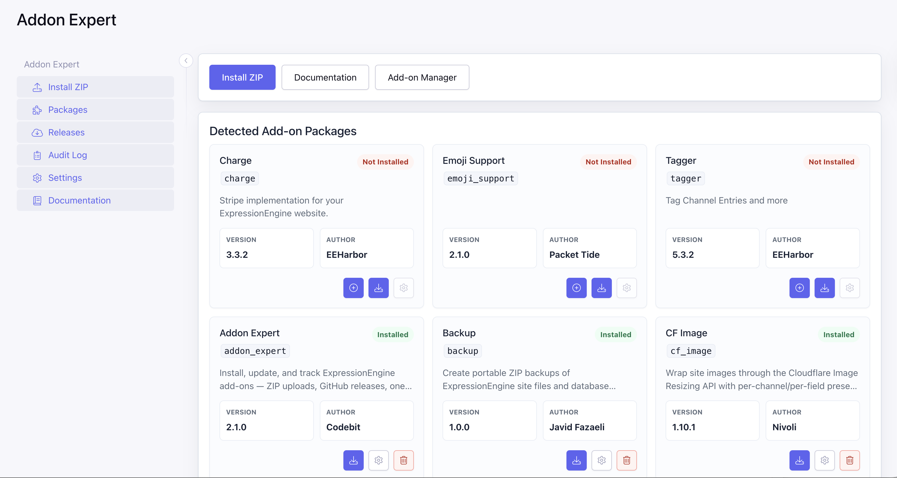
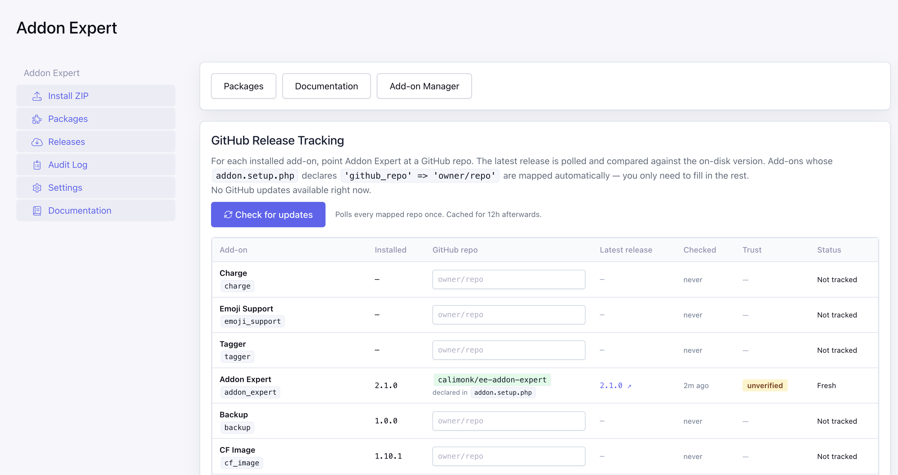
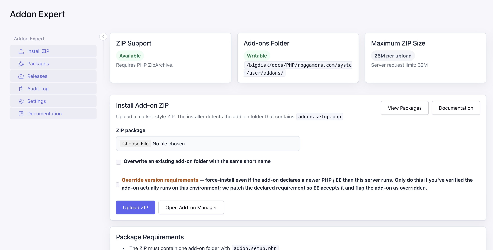
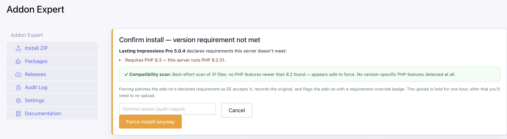
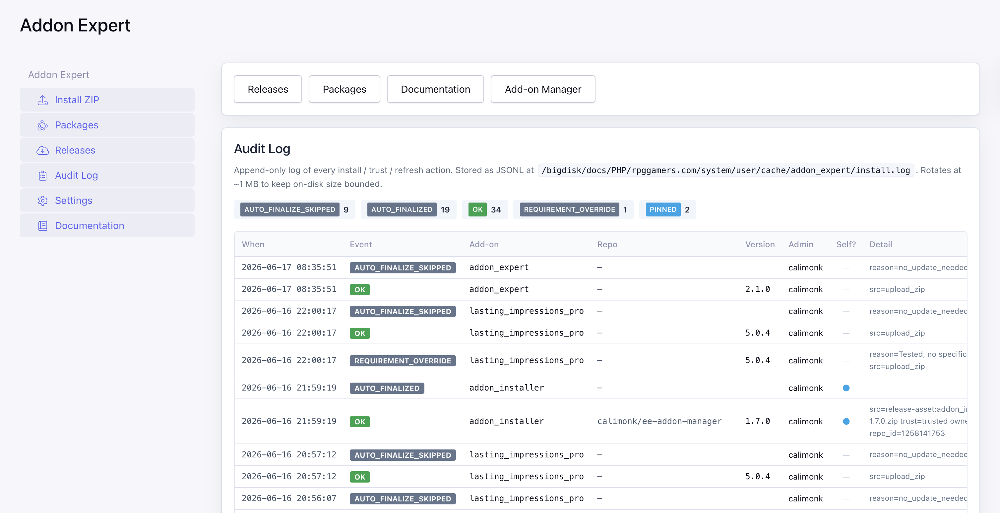
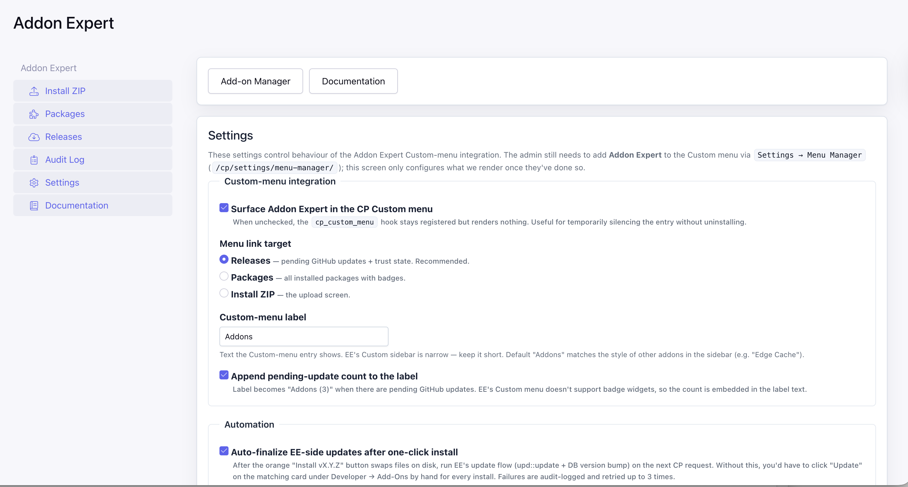

# Addon Expert

**Install, update, and track ExpressionEngine add-ons from the EE 7 control panel — ZIP uploads, GitHub releases, one-click updates, and supply-chain checks.**

Maintainer: Codebit · License: MIT · Version: 2.1.0

> **Addon Expert is a fork of [Addon Manager +](https://github.com/jfaza/addon-manager-plus)
> by Javid Fazaeli** (MIT), extended with GitHub release tracking, one-click
> updates, auto-finalize, supply-chain (TOFU) protection, a requirement
> override with a compatibility scanner, and a CP custom-menu integration.
> The original ZIP-upload installer is Javid's work; the additions are
> maintained independently by Codebit. Full credit to Javid for the
> foundation.

---

## Why This Exists

The standard ExpressionEngine add-on installation workflow involves:

1. Download a ZIP from a third-party source.
2. Unzip it locally.
3. Locate the real add-on folder (sometimes nested inside a wrapper folder).
4. Upload that folder to `system/user/addons/` via FTP or SSH.
5. Return to the ExpressionEngine control panel to complete the install.

Addon Expert keeps more of this workflow inside the control panel: upload the ZIP, and the add-on detects the real folder, extracts it into the correct location, and presents the install button — all without touching FTP.

## Features

**Install from ZIP** (the original Addon Manager + foundation)
- Upload third-party add-on ZIP packages directly from the control panel.
- Detect the real add-on folder automatically by locating `addon.setup.php`, including inside a wrapper folder.
- Extract packages into the active add-ons directory; reject unsafe ZIP paths (absolute paths, `..` traversal).
- Generate package downloads on demand without permanently storing ZIP files.
- Link back into ExpressionEngine's native install / update / settings / uninstall flow.

**Track GitHub releases**
- Map any installed add-on to a GitHub repo — author-declared (`'github_repo'` in `addon.setup.php`) or admin-mapped on the Releases screen.
- Poll `/releases/latest`, compare to the on-disk version, and surface a `GitHub: vX.Y.Z ↗` badge plus a sidebar count of pending updates.
- 1-hour cache with lazy parallel refresh on the Releases screen; an explicit "Check for updates" button forces a full refresh.

**One-click update + auto-finalize**
- Download → safe-extract → atomic swap → opcache-invalidate, with a rolling backup kept outside the add-ons directory.
- Auto-finalize the EE-side version bump (runs the add-on's `upd.php` + updates `exp_modules` / `exp_extensions`) so you don't have to click through Developer → Add-Ons. Covers both GitHub installs and manual ZIP uploads.

**Supply-chain protection**
- Trust-on-first-use: pins the GitHub repo's stable numeric identifiers and hard-blocks an install if they change (RepoJacking / ownership transfer), with a "Reconfirm trust" path for legitimate changes.
- Append-only JSONL audit log of every install / trust / override event, on its own Audit Log screen.

**Compatibility & overrides**
- Pre-flight `requires` check (PHP / EE version) before extraction — surfaces the same verdict EE would give, earlier.
- Optional force-override for an over-declared requirement, gated by a heuristic feature scan ("no PHP 8.3 features detected — appears safe to force" vs "uses `json_validate()` — will fatal"), with a persistent override badge.

**CP integration**
- Optional Custom-menu entry with a configurable label and a pending-update count.

## Requirements

- ExpressionEngine 7
- PHP `ZipArchive` extension
- A writable add-ons directory (`system/user/addons/`)
- Control panel access with permission to manage add-ons

## Installation

1. Copy the `addon_expert/` folder into `system/user/addons/`.
2. In ExpressionEngine, open **Developer > Add-Ons**.
3. Find **Addon Expert** and click **Install**.
4. Click **Settings** next to Addon Expert to open it.

## Usage

Addon Expert adds five screens under **Developer → Add-Ons → Addon Expert**:
**Install ZIP**, **Packages**, **Releases**, **Audit Log**, and **Settings**.

### Install ZIP

1. Go to **Addon Expert → Install ZIP** and pick a `.zip` package.
2. On upload, the package is **inspected and scanned before anything is
   committed**:
   - **Compatible** → extracted and installed straight through, and the
     EE-side version is auto-finalized on the next screen load.
   - **Incompatible** (declares a newer PHP/EE than this server runs) →
     the upload is **held** and you're shown a confirm screen with the
     unmet requirement, an inline compatibility-scan verdict, and a
     one-click **Force install anyway** (or **Cancel**). No re-uploading.
3. Tick **Overwrite** to replace an existing add-on folder of the same
   short name. Tick **Override version requirements** up front to force
   an incompatible package immediately and skip the confirm step.

### Packages

All detected packages render as cards with status badges:

| Badge | Meaning |
|-------|---------|
| Installed | Extracted and installed in ExpressionEngine. |
| Not Installed | Extracted but not yet installed. |
| Update Available | A newer version is on disk than EE has recorded. |
| `GitHub: vX.Y.Z ↗` | A newer release exists on the mapped GitHub repo (links to it). |
| ⚠ incompatible | The package's declared PHP/EE requirement isn't met on this server. |
| ⚠ requirement override | This add-on was force-installed past its declared requirement (shows the original requirement + the scan verdict captured at force time). |

Per-card actions: **Install**, **Update** (EE-local), **Update from
GitHub** (orange, when a newer release exists), **Settings** (when the
add-on declares one), **Download**, **Uninstall**.

### Releases

Maps each installed add-on to a GitHub repo and tracks updates. Per row:
installed version, mapped repo (read-only when author-declared, editable
otherwise), latest release, last-checked age, trust state, and the
install/reconfirm action. **Check for updates** forces a full refresh;
otherwise stale entries refresh lazily (and in parallel) when the screen
loads.

### Audit Log

An append-only JSONL trail of every install, failure, block, trust pin,
override, and auto-finalize — with per-event-type counts, a "self?"
column flagging self-updates, and grep recipes for the raw file at
`system/user/cache/addon_expert/install.log`.

### Settings

- **Custom-menu integration** — show Addon Expert in the CP Custom menu,
  with a configurable label (default "Addons") and an optional pending-
  update count (`Addons (3)`). The admin still adds the entry once via
  **Settings → Menu Manager**.
- **Auto-finalize** the EE-side update after an install (default on).
- **Lazy refresh** stale release caches when the Releases screen loads
  (default on).

## Package Format

The ZIP should contain one add-on folder named with the add-on short name:

```text
my_addon/
  addon.setup.php
  upd.my_addon.php
  mcp.my_addon.php
  ...
```

Wrapper folders are allowed:

```text
downloaded-release/
  my_addon/
    addon.setup.php
    upd.my_addon.php
```

Loose add-on files at the ZIP root are rejected because the installer cannot infer the destination folder name. Valid add-on folder names use lowercase letters, numbers, and underscores.

## Security Notes

- ZIP entries with absolute paths or `..` segments are rejected before extraction.
- Only files inside the detected add-on folder are extracted.
- The add-on does not execute or evaluate uploaded PHP files during extraction.
- ExpressionEngine's own permission system controls who can access the control panel module.
- Do not grant control panel access to untrusted users — extracted add-on code runs with the same privileges as any other installed add-on.

## Known Limitations

- Only ZIP archives are supported; `.tar.gz` and other formats are not.
- Addon Expert does not publish or fetch packages from a remote registry; all packages must be uploaded manually.
- The download feature regenerates ZIPs from the current on-disk files, not from the original uploaded archive.

## Screenshots

### Packages



Every detected add-on as a card with status badges (Installed / Not
Installed) and per-card actions. Addon Expert tracks itself here too.

### Releases



Map each add-on to a GitHub repo, see the latest release, trust state,
and last-checked age. Author-declared mappings (like Addon Expert's own
`calimonk/ee-addon-expert`) are filled in automatically and shown
read-only.

### Install ZIP



Drag-free upload with environment status cards, plus the overwrite and
override-version-requirements options.

### Install ZIP — confirm



When a package declares a newer PHP/EE than the server runs, the upload
is held and you get the unmet requirement, the inline compatibility-scan
verdict, and a one-click Force / Cancel — no re-uploading.

### Audit Log



Append-only event trail with per-type counts and a self-update flag.

### Settings



Custom-menu integration (label + pending-update count), auto-finalize,
and lazy-refresh toggles.

## Tracking GitHub Releases

Addon Expert can poll GitHub Releases for every installed add-on and surface
a single "updates available" count in the EE CP sidebar — covering EE-store
add-ons (the existing upload flow) AND add-ons distributed on GitHub.

Two resolution layers, in priority order:

1. **Author-declared.** Add `'github_repo' => 'owner/repo'` to the add-on's
   `addon.setup.php`. Opt-in, decentralized, survives admin reinstall.
2. **Admin-mapped.** Open **Addon Expert → Releases** and fill in
   `owner/repo` for any installed add-on whose author hasn't declared one.
   Persisted to `system/user/config/addon_expert_mappings.json`.

The Releases screen lists every installed add-on with its installed version,
mapped repo, latest release, and last-check timestamp. Click **Check for
updates** to refresh all mapped repos (1-hour cache, sentinel-on-failure so a
flaky network doesn't hammer GitHub; stale entries also refresh lazily and in
parallel when the screen loads). The Packages screen swaps in a
"GitHub: vX.Y.Z ↗" badge whenever a newer release exists.

### One-click update from GitHub

When a newer release is detected, an orange cloud-download button appears
on the Packages card (and an "Install vX.Y.Z" button on the Releases row).
Clicking it:

1. Re-fetches the latest release from the GitHub API.
2. Picks a download URL — preferring release assets named after the
   add-on (`{short_name}-{version}.zip`), then any `.zip` asset, then
   the auto-generated `zipball_url` (source archive).
3. Streams the archive to a temp file, capped at 100 MB.
4. Extracts into a staging directory next to the add-on, applying the
   same `..` / absolute-path safety filter the upload flow uses.
5. Locates the add-on subtree inside the zip by finding the
   `addon.setup.php` whose parent folder matches `short_name`. Falls
   back to the wrapper root for single-add-on source zipballs.
6. Moves the existing add-on to
   `system/user/cache/addon_expert/backups/{short_name}/{ts}/` (only
   one backup per short_name is kept — older ones are removed first).
   The backup lives explicitly OUTSIDE `system/user/addons/` so EE's
   PSR-4 addon discovery can't see it; `rename()` is attempted first,
   with a copy-then-remove fallback for cross-filesystem moves.
7. Renames the staging dir into place; invalidates PHP opcache for
   every file in the new install so the next request sees the new
   code immediately.
8. Forgets the release cache so the new on-disk version is read fresh.
9. Redirects to EE's native **Add-Ons** list so the admin clicks the
   **Update** prompt on the affected card to finalize — exactly the
   flow a manually-uploaded zip uses, with EE's own POST + CSRF form.

If anything fails, the previous version stays in place (or is restored
from backup), and the failure surfaces as a CP banner.

GitHub API calls are unauthenticated (public repos only). The 60-requests/hour
unauthenticated quota per IP is far above any realistic site's add-on count.

### Supply-chain protection

GitHub-distributed add-ons sit in a known attack class: an upstream maintainer
can lose control of their account, sell the repo, or have it deleted and
re-claimed by a malicious actor under the same `owner/repo` name (RepoJacking).
Addon Expert treats every install path as a supply-chain decision and
pins a **trust anchor** on first use.

- On the first install of a GitHub-mapped add-on, the GitHub-controlled stable
  identifiers — owner numeric ID, repo numeric ID, repo `created_at` — are
  pinned to `system/user/config/addon_expert_trust.json` alongside which
  EE admin pinned them and when.
- Every install attempt re-fetches identity from GitHub **bypassing the cache**
  and compares. Any mismatch hard-blocks the install and surfaces a banner
  listing exactly which fields changed.
- Username renames are *not* an alarm — owner numeric ID is stable across
  renames. Only real ownership transfers and delete+recreate scenarios trip
  the check.
- The Releases screen shows the trust state per add-on (`✓ trusted`,
  `⚠ CHANGED`, `unverified`) and offers a **Reconfirm trust** action for
  legitimate identity changes. Reconfirming is itself audit-logged.
- Every install and trust event writes to
  `system/user/cache/addon_expert/install.log` (JSONL), surfaced on the
  dedicated **Audit Log** screen. Useful for forensics after the fact.

The same rules apply to Addon Expert's own self-update — a hostile
takeover of our own repo would otherwise become a vector via the one-click
flow.

## Roadmap

- Remote package registry / URL install
- Bulk install from a ZIP containing multiple add-ons
- Improved version conflict UI
- Optional authenticated GitHub calls (PAT) for sites that pin private
  forks of add-ons

## Changelog / Releases

See [CHANGELOG.md](CHANGELOG.md) for a full version history.

## Development

Additional project documentation lives in the [wiki/](wiki/) directory:

- [Home](wiki/Home.md)
- [Installation](wiki/Installation.md)
- [Package Format](wiki/Package-Format.md)
- [Package Workflow](wiki/Package-Workflow.md)
- [Security Model](wiki/Security-Model.md)
- [Development](wiki/Development.md)

Run PHP lint after editing PHP files:

```bash
for f in *.php ControlPanel/*.php ControlPanel/Routes/*.php Service/*.php views/*.php; do php -l "$f" || exit 1; done
```

`AGENTS.md` is local development guidance and is intentionally not part of this repository's public documentation.

## License

MIT. See [LICENSE](LICENSE).
